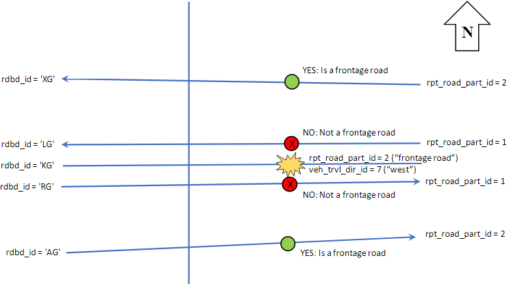

# Crash Direction

The process in this document tries to crack the problem where we don't know which direction a crash is registered to on expressway or frontage roads, because the TxDOT process quite often pins crashes to centerlines. As part of this process, a more positive nearest-neighbor geometry matching scheme is proposed that does more to tie crashes with the correct roadway segments, especially around intersections.

> **TODO:** This is proposed, but has not been implemented.

This diagram captures some of the process described below while also adding context to some of the TxDOT Roadway Inventory and CRIS fields used:

## First Part: Crash Match to Correct Roads

Here we're going to attempt to match crashes using a scheme that's better than the "nearest neighbor" approach that was used earlier. We exhaust the more reliable mapping clues available, especially around on-system roadways, and then as a last step for unmatched roads, we resort to the "nearest neighbor".

To do this, we need to positively identify each crash of interest (for `located_fl = 'Y'`) to `rte_grid`.

Perhaps we can use an additive point scheme to identify the best matches. (Originally, I was thinking of an elimination scheme to isolate down to the desired roadway, but apart from the performance improvements that I'd expect as things are eliminated, I wonder if too much would be eliminated in order to effectively debug.)

> **Note:** I'll be using `road_part_adj_id` instead of `rpt_road_part_id`.

**Step 1: Nearest geometry:** Start with crash locations in `crash_buf_100`. (Ensure that the table is current and has all crashes for the 2010-2019 analysis period.) Filter for crashes that are 50m apart or less.

**Step 2: Add 2 points for all nearest that share on-system status**. This would mean evaluating according to this table:

Database | Test (Positive) | Test (Negative)
-|-|-
CRIS | `onsys_fl = 'Y'` | `onsys_fl = 'N'`.
Roadway Inv | `rec IN (0, 1, 2, 3)` | `rec IN (5, 7, 8, 9)` 

**Step 3: Add 2 points for matches in highway name** for cases where a highway name exists. This table helps in matching highway numbers:

Database | Fields
-|-
CRIS | Use `hwy_sys` (equals 'SH', 'IH', 'FM', etc.), `hwy_nbr` (e.g. 1), `hwy_sfx` (may be NULL)
Roadway Inv | Use `hsys` (equals 'SH', etc.), `hnum` (e.g. '0001'), `hsuf` (may be NULL)

**Step 4: Add 1 point for matches in grade separation**. This table has criteria:

Database | Fields
-|-
CRIS | `rpt_road_part_id = 5`
Roadway Inv | `rec = 0` or `rdbd_id = 'GS'`

**Step 5: Add 2 points for matches or close similarities in street name** so long as street name exists and proximity is close. Fields to watch out for:

Database | Fields
-|-
CRIS | `street_name`
Roadway Inv | `ste_nam`... most of the time

**Step 6: Add 1 point for nearest neighbor**. This is meant to be a tie-breaker if no other criteria produced a clear winner.

**Step 7: Propagate everything that is highest scoring**.

## Second Part: Road Classification

As a sanity check, see if any existing road classification to a mainline, frontage road, or ramp/connector is inconsistent with the match we discovered. If so, move it to the centerline. (In TxDOT Roadway Inventory, `hwy` will be the same for all that share the corridor; moving to the centerline involves selecting the geometry where `rdbd_id = 'KG'`). That would be for matches that meet these criteria:

Test | CRIS | Matched Roadway Inv 
-|-|-
Crash shouldn't be on frontage road or connector | `road_part_adj_id = 1` | `rec IN (0, 2, 3)`
Crash shouldn't be on mainline or connector | `road_part_adj_id = 2` | `rec IN (0, 1)`
Crash shouldn't be on mainline or frontage | `road_part_adj_id IN (3, 4, 5)` | `rec IN (1, 2, 3)`

Then, if the match is made to a centerline (`rdbd_id = 'KG'`), figure out if we need to isolate to a frontage road or mainline (where `hwy` is the same). Only process one of these based on crash road part.

Test | CRIS | Matched Roadway Inv 
-|-|-
Crash should be on mainline | `road_part_adj_id = 1` | `rec = 1`
Crash should be on frontage road | `road_part_adj_id = 2` | `rec IN (2, 3)`
Crash should be on connector | `road_part_adj_id = 5` | `rec = 0`
Crash should be on ramp (tricky) | `road_part_adj_id IN (3, 4)` | `rec IN (2, 3)`

I assume at this point that if a crash location is geographically tied to just a single carriageway or direction of frontage road, then it was intentionally set by TxDOT.

## Third Part: Identify Direction

Finally, in cases where more than one possibility exists, we shall use the crash direction of travel indicated by the crash record.

The key to this will be to look at the traveling direction `veh_trvl_dir_id` of selected non-parked units that are verified to not be "wrong-way drivers", and compare the given direction with the direction of the candidate roadway segments.

veh_trvl_dir_id | Meaning
-|-
11 | UNKNOWN
3 | EAST
1 | NORTH
2 | NORTHEAST
8 | NORTHWEST
5 | SOUTH
4 | SOUTHEAST
6 | SOUTHWEST
7 | WEST

We also need to ensure that this condition is not true for Units that are considered: `First_Harm_Evt_Inv_ID = 'Y' AND Contrib_Factr_1_ID IN (3, 69, 70, 71)'`. (That's "backed without safety", "wrong side", and "wrong way - one way road")

### Method 1: Minimal Unit Number

Idea: look at the minimal unit in motion and use its direction of travel against all roadbeds that survived the previous steps. But, also prevent the use of direction of travel if the contributing factor is wrong-way driving!

### Method 2: Minimal Useful Angle

Idea: Analyze all non-parked, non-wrong-way driving units. Identify the unit that exhibits the minimal angle to the recorded direction of travel among all of the roadbeds that survived the previous steps.

## Random Stuff and References

**That's about as far as I got** in working through this. There would still be a little bit more work to do before implementing the strategy, including activities drawn from here:

If nearest road segment to crash is a centerline (look at earlier queries)

Reporting on "at_intrsct_fl" vs. "intrsct_relat_id".

Frontage: rpt_road_part_id = 2 OR rpt_sec_road_part_id = 2

rpt_road_part_id | Meaning
-|-
1 | MAIN/PROPER LANE
2 | SERVICE/FRONTAGE ROAD
3 | ENTRANCE/ON RAMP
4 | EXIT/OFF RAMP
5 | CONNECTOR/FLYOVER
7 | OTHER (EXPLAIN IN NARRATIVE)

Direction: Rpt_Ref_Mark_Dir

Recall: Investigat_Comp_Fl
