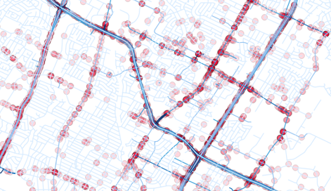
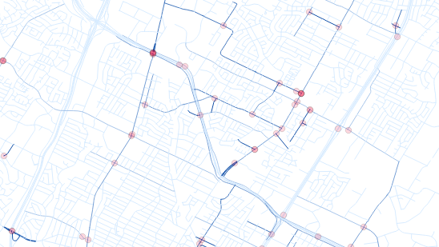

# <!-- omit in toc -->Database Functions

This documentation outlines database tables, queries and access for the Ped Crash project.

- [Ped Crashes](#ped-crashes)
  - [Creation of Ped Crash Criteria Table](#creation-of-ped-crash-criteria-table)
  - [Observations on Ped Crash Criteria](#observations-on-ped-crash-criteria)
- [Crash to Segment Matchup](#crash-to-segment-matchup)
  - [Table Creation and Defintion](#table-creation-and-defintion)
  - [Populating the Mapping](#populating-the-mapping)
- [Crash Stats for Segments](#crash-stats-for-segments)
  - [Table Creation and Definition](#table-creation-and-definition)
  - [Running the Stats](#running-the-stats)
  - [Visualizing Density in QGIS](#visualizing-density-in-qgis)
- [Better Ped Crash Simple Data](#better-ped-crash-simple-data)
- [Queries for TxDOT Roadway Inventory](#queries-for-txdot-roadway-inventory)
- [Other Queries](#other-queries)
  - [Checking Driver ZIP Code Comprehension](#checking-driver-zip-code-comprehension)
- [R Code](#r-code)

## Ped Crashes
It is important to have a reproducible approach to identify in queries whether a crash is a pedestrian related crash. The solution proposed here is to query for criteria and store those results into a table that can be leveraged for filtering. To determine whether a crash is a "ped crash", several criteria are identified:
- One or more Units are identified as a pedestrian (via `unit_desc_id = 4`)
- One or more Persons/Primarypersons are identified as a pedestrian (via `prsn_type_id = 4`)
- The "harmful event" of a crash is a pedestrian injury (via `harm_evnt_id = 1`)
- The "other factor" involves a swerve or slowing down because of a pedestrian (via `othr_factr_id = 28` or `othr_factr_id = 39`, respectively)

*These criteria may or may not be mutually exclusive!* There are a number of cases in queries below that it is evident that it may be necessary to "or" all of the ciriteria together. (It may be because of errors or incompletness in reporting, or a lack of understainding on how reporting is supposed to work.)

### Creation of Ped Crash Criteria Table
This creates the `ped_activity` table and initializes it with all crash identifiers:
```sql
CREATE TABLE ped_activity (
  crash_id integer PRIMARY KEY REFERENCES share_crash(crash_id),
  ped_count_u integer,
  ped_count_p integer,
  ped_fatal integer,
  ped_count integer DEFAULT 0,
  ped_harmful boolean DEFAULT FALSE,
  ped_avoid boolean DEFAULT FALSE,
  ped_crash boolean DEFAULT FALSE
);
INSERT INTO ped_activity (crash_id) SELECT u.crash_id FROM share_crash u;
```

These are the definitions for the columns:
- **crash_id:** For each CRIS Share Crash ID, there exists one ID here. Thus, one record exists for each crash record.
- **ped_crash_u:** Number of CRIS Share Units that indicate ped crash activity. For crash records that have no Unit identified with them, this is NULL.
- **ped_crash_p:** Number of CRIS Share Person/Primaryperson records that indicate ped crash activity. For crash records that have no Unit or Persons/Primarypersons identified with them, this is NULL.
- **ped_fatal:** Number of pedestrian fatalities that are indicated through the `share_allperson` Person/Primaryperson view where `prsn_injry_sev_id = 4`, which indicates fatality.
- **ped_count:** This is the greater of `ped_crash_u` and `ped_crash_p`, or 0 if both are NULL.
- **ped_harmful:** This is set to TRUE if the corresponding crash record has `harm_evnt_id = 1`, which indicates that the primary harmful event is pedestrian injury.
- **ped_avoid:** This is set to TRUE if the corresponding crash record has `othr_factr_id = 28` or `othr_factr_id = 39` which implies that the driver was primarily trying to avoid a pedestrian.
- **ped_crash:** This is set to TRUE if `ped_count > 0`, `ped_harmful = TRUE`, and/or `ped_avoid = TRUE`. *This would be the final indication that the corresponding crash is a "ped crash"*.

These fields are populated using the following queries:
```sql
-- Get the number of unit pedestrians to fill the ped_count_u field. Count will be written only
-- in cases where units exist.
WITH q AS (
  SELECT crash_id, COUNT(CASE WHEN unit_desc_id = 4 THEN 1 END) unit_count
  FROM share_unit
  GROUP BY crash_id
)
UPDATE ped_activity SET ped_count_u = q.unit_count FROM q WHERE ped_activity.crash_id = q.crash_id;

-- Get the number of person pedestrians to fill the ped_count_p field. Count will be written only
-- in cases where person records exist.
WITH q AS (
  SELECT p.crash_id, COUNT(CASE WHEN p.prsn_type_id = 4 THEN 1 END) person_count
  FROM share_unit u, share_allperson p
  WHERE p.crash_id = u.crash_id
    AND p.unit_nbr = u.unit_nbr
  GROUP BY p.crash_id
)
UPDATE ped_activity SET ped_count_p = q.person_count FROM q WHERE ped_activity.crash_id = q.crash_id;

-- Get the final count:
UPDATE ped_activity
  SET ped_count = GREATEST(COALESCE(ped_count_p, 0), COALESCE(ped_count_u, 0));

-- How many ped-crash fatalities? Fill the ped_fatal count. We get this from the person table.
WITH q AS (
  SELECT p.crash_id, COUNT(CASE WHEN p.prsn_type_id = 4 AND p.prsn_injry_sev_id = 4 THEN 1 END) fatal_count
  FROM share_unit u, share_allperson p
  WHERE p.crash_id = u.crash_id
    AND p.unit_nbr = u.unit_nbr
  GROUP BY p.crash_id
)
UPDATE ped_activity SET ped_fatal = q.fatal_count FROM q WHERE ped_activity.crash_id = q.crash_id;  

-- Fill in the "ped_harmful" flag for ped_activity:
WITH q AS (SELECT crash_id FROM share_crash WHERE harm_evnt_id = 1)
UPDATE ped_activity SET ped_harmful = TRUE FROM q WHERE ped_activity.crash_id = q.crash_id;

-- Fill in "ped_avoid" using the "Other Factor" from the crash record:
WITH q AS (
  SELECT crash_id FROM share_crash
  WHERE othr_factr_id = 28 OR othr_factr_id = 39
)
UPDATE ped_activity SET ped_avoid = TRUE FROM q WHERE ped_activity.crash_id = q.crash_id;

-- Complete the "ped_crash" field in ped_activity:
UPDATE ped_activity SET ped_crash = ped_count > 0 OR ped_harmful OR ped_avoid;
```

### Observations on Ped Crash Criteria
Recall in the previous section that crash records show a variety of combinations of pedestrian activitiy, some of which are counterintuitively mutually exclusive. These queries are run on the 2018 CRIS Share records to identify how many there are:

```sql
-- Number of crashes where the "harmful event" is "pedestrian" (harm_evnt_id = 1)
SELECT COUNT(1) FROM share_crash WHERE harm_evnt_id = 1;
-- That's 66245

-- Number of crashes where the harmful event is a pedestrian, but it isn't a ped crash
-- per Unit or Person:
SELECT COUNT(1)
FROM share_crash c
WHERE harm_evnt_id = 1
  AND NOT EXISTS (
    SELECT 1 FROM ped_activity WHERE crash_id = c.crash_id AND ped_count > 0
  );
-- That's 0. That's expected.

-- Number of crashes where a ped is avoided due to swerve or slowing:
SELECT COUNT(1)
FROM share_crash
WHERE othr_factr_id = 28 OR othr_factr_id = 39;
-- That's 6268

-- Number of crashes where a ped is avoided and it isn't a ped crash per Unit or Person:
SELECT COUNT(1)
FROM share_crash c
WHERE othr_factr_id = 28 OR othr_factr_id = 39
  AND NOT EXISTS (
    SELECT 1 FROM ped_activity WHERE crash_id = c.crash_id AND ped_count > 0
  );
-- That's 6060

-- How many fatal crashes with ped activity where a ped was not killed?
SELECT COUNT(1)
FROM share_crash c, ped_activity p
WHERE c.crash_id = p.crash_id
  AND c.crash_fatal_fl = 'Y'
  AND p.ped_count > 0
  AND p.ped_fatal = 0;
-- 47

-- How many "ped crashes" do we have?
SELECT COUNT(1) FROM ped_activity WHERE ped_crash = TRUE;
-- That's 78996
```

## Crash to Segment Matchup
To begin answering the question of segment crash density, crash locations are mapped to TxDOT Roadway Inventory segments. While it is possible to think of simply matching crash locations (that have lat, lon coordinates) to the nearest TxDOT Roadway Inventroy segment geometry, this may or may not offer the desired results. For example, crashes that exist at an intersection may be applicable to the cross street, or both streets. Or, crashes near two grade-separated roads are ambiguous by lat/lon alone. While there are more opportunities for geocoding street names, addresses, etc. and assigning to the correct segment, a solution for the time being is to draw a buffer around crash locations and then tie those roadway segments that intersect the buffer to the crash. That may allow multiple nearby segments to be related a single crash.

Issues that remain after this include:
- Segments on both directions of a divided roadway are matched
- Segments at grade separations around a crash are all matched
- Of the 627,760 crash records from 2018, 13,424 of them have reported lat, lon corrdinates (`rpt_latitude`, `rpt_longitude`) that were not cleaned (put into `latitude`, `longitude`). It has yet to be seen if these coordinates are accurate enough to use.

### Table Creation and Defintion
The command for creating the `crash_buf_100` table is:
```sql
CREATE TABLE crash_buf_100 (
  roadway_gid integer,
  frm_dfo real, -- TODO: To be consistent with TxDOT Roadway Inventory,
  -- this needs to be numeric. When changed, remove numeric casts from other queries.
  crash_id integer,
  distance real,
  lin_ref real,
  primary_gid integer, 
  nearest boolean DEFAULT FALSE,
  PRIMARY KEY (crash_id, roadway_gid)
);
```

This is the purpose for each column:
- **roadway_gid:** The `gid` value found in the TxDOT Roadway Inventory `roadway_inv`. Note that several entries within `roadway_inv` can share the same `gid` value.
- **frm_dfo:** This is the corresponding `frm_dfo` value from the TxDOT Roadway Geometry that corresponds with the closest matched sub-segment.
- **crash_id:** The corresponding Crash ID `crash_id` found in the `share_crash` table, but only one of them will have `nearest = TRUE`. Note that one `crash_id` may have many `roadway_inv` entries. `crash_id` that were not successfully matched to any roadway geometry are not currently included in this table. **TODO:** Consider adding all Crash IDs and setting other fields to NULL.
- **distance:** The distance (in meters) from the crash point to the nearest part of the given segment geometry.
- **lin_ref:** The linear reference along the corresponding TxDOT Roadway Inventory geometry that corresponds with the closest point on that geometry to the crash location. In most cases, this is populated except for the small handful of geometry that is MultiLine geometry.
- **primary_gid:** Attempts to tie directional geometry to centerline geometry (e.g. giving the GID for the "-KG" segment that corresponds with "-RG" or "-LG" directional segments). This is null if we're already a centerline.
- **nearest:** This is set to TRUE if the given segment is the closest that's matched to the crash location. Note that "closest" may not necessarily mean "zero-distance" for segments that don't have directly nearby (e.g. distance < 10m) matched crashes. That could possibly happen if a crash happens in a parking lot, for example, since only roadway geometry is represented in the TxDOT Roadway Inventory.

### Populating the Mapping
This fills out `crash_buf_100`, matching crashes to all TxDOT Roadway Inventory geometry that's 100 meters or closer. This takes 10-15 minutes to run for a year's worth of crashes:

```sql
INSERT INTO crash_buf_100 (roadway_gid, crash_id, frm_dfo, distance)
  SELECT DISTINCT ON (r.gid, c.crash_id) 
    r.gid roadway_gid, c.crash_id, ST_Distance(c.location, r.geog) distance, r.frm_dfo
  FROM roadway_inv r, share_crash c
  WHERE ST_DWithin(c.location, r.geog, 100)
    AND EXTRACT(YEAR FROM c.crash_date) = '2019'
  ORDER BY r.gid, c.crash_id, ST_Distance(c.location, r.geog);
```

This will complete the `primary_gid` field:
```sql
WITH q AS (
  SELECT DISTINCT ON (cb.crash_id, cb.roadway_gid)
  cb.crash_id, cb.roadway_gid, ABS(r2.frm_dfo - r1.frm_dfo) AS dist, r2.gid primary_gid
  FROM crash_buf_100 cb, roadway_inv r1, roadway_inv r2
  WHERE r1.gid = cb.roadway_gid
    AND r1.frm_dfo = cb.frm_dfo::numeric
    AND r1.rte_grid = r2.rte_grid
    AND r2.ria_rte_id LIKE '%-KG'
    AND (r1.ria_rte_id LIKE '%-LG' OR r1.ria_rte_id LIKE '%-RG')
  ORDER BY cb.crash_id, cb.roadway_gid, ABS(r2.frm_dfo - r1.frm_dfo), r2.gid
)
UPDATE crash_buf_100 cb
  SET primary_gid = q.primary_gid
  FROM q
  WHERE q.crash_id = cb.crash_id
    AND q.roadway_gid = cb.roadway_gid;
```

This code attempts to perform the linear referencing:
```sql
-- ST_LineMerge() doesn't fix all of the Roadway Inventory.
-- About 5 segments in the TxDOT Roadway Geometry don't process, which misses 18 crashes.
WITH p AS (
  SELECT gid, frm_dfo, len_sec, ST_LineMerge(geog::geometry) geom
  FROM roadway_inv r
  WHERE ST_GeometryType(ST_LineMerge(geog::geometry)) = 'ST_LineString'
), q AS (
  SELECT p.gid, c.crash_id,
	  ST_Line_Locate_Point(p.geom, c.location::geometry) * p.len_sec + p.frm_dfo lin_ref
  FROM crash_buf_100 cb, p, share_crash c
  WHERE cb.roadway_gid = p.gid
    AND cb.frm_dfo::numeric = p.frm_dfo
    AND cb.crash_id = c.crash_id	
)	
UPDATE crash_buf_100
SET lin_ref = q.lin_ref
FROM q
WHERE crash_buf_100.roadway_gid = q.gid
  AND crash_buf_100.crash_id = q.crash_id;
```

Finally, this identifies the nearest crash sites, populating the `nearest` column:
```sql
WITH q AS (
  SELECT DISTINCT ON (crash_id)
    roadway_gid, crash_id, distance
  FROM crash_buf_100
  ORDER BY crash_id, distance
)
UPDATE crash_buf_100
SET nearest = TRUE
FROM q
WHERE crash_buf_100.roadway_gid = q.roadway_gid
  AND crash_buf_100.crash_id = q.crash_id;
```

## Crash Stats for Segments
The `crash_stats_seg` table is where statistics generated on crashes associated with segments are stored.

A currently encountered drawback is that some segments are 0.001 mile long, while other segments are over 50 miles long. This can create high density measurements that are not accurate or useful. A solution is to resample to a uniform distance, and that's explored in the [Uniform Segments document](uniform_seg.md). *For the time being here, densities are capped at 100 crashes/mile.*

### Table Creation and Definition
This creates the table:
```sql
CREATE TABLE crash_stats_seg (
  roadway_gid integer PRIMARY KEY,
  count_50_all_2018 integer NOT NULL DEFAULT 0,
  count_50_ped_2018 integer NOT NULL DEFAULT 0,
  count_50_pedfatal_2018 integer NOT NULL DEFAULT 0,
  count_50_all integer NOT NULL DEFAULT 0,
  count_50_ped integer NOT NULL DEFAULT 0,
  count_50_pedfatal integer NOT NULL DEFAULT 0,
  count_nearest_all_2018 integer NOT NULL DEFAULT 0,
  count_nearest_ped_2018 integer NOT NULL DEFAULT 0,
  count_nearest_pedfatal_2018 integer NOT NULL DEFAULT 0,
  count_nearest_all integer NOT NULL DEFAULT 0,
  count_nearest_ped integer NOT NULL DEFAULT 0,
  count_nearest_pedfatal integer NOT NULL DEFAULT 0,
  seg_length real
);
```

The definitions are:
- **roadway_gid:** The `gid` value from the TxDOT Roadway Inventory `roadway_inv` table. Note that several subsequent segments may share the same `gid` value.
- **seg_length:** The total segment length of the respective segment, useful for calculating rudimentary densities.
- **count...:** Counts of crashes as labeled-- within 50 meters, for "nearest" records, for ped crashes, or for ped fatality crashes.

To initialize the `crash_stats_seg` table, segments with total sum of length greater than a minumum number of miles are selected to prevent matching on the tiniest lone segments. (Again, revising this to sample along segments for density measurements will be a more robust approach). **TODO:** This is currently set to 0.001, which happens to grab all of the segments.
```sql
WITH q AS (
  SELECT gid, SUM(len_sec) length
  FROM roadway_inv
  GROUP BY gid
)
INSERT INTO crash_stats_seg (roadway_gid)
  SELECT gid FROM q
  WHERE length > 0.001;
```

### Running the Stats

To get the total length:
```sql
WITH q AS (
  SELECT gid roadway_gid, SUM(len_sec) seg_length
  FROM roadway_inv
  GROUP BY gid
)
UPDATE crash_stats_seg
SET seg_length = q.seg_length
FROM q
WHERE crash_stats_seg.roadway_gid = q.roadway_gid;
```

Queries for populating the counts are located in [the Crash Stats Segments Breakdown](crash_stats_seg.md).

### Visualizing Density in QGIS
**TODO: We need to revise this to calculate density from counts.**

QGIS can be set up to leverage a database. To effectively and most easily use the statistics joined with the TxDOT Roadway Inventory `roadway_inv`, a view is created that can be readily loaded.

In creating such a view, QGIS needs to have a column that has a unique identifier. Because `gid` can correspond with more than one row in `roadway_inv`, a new unique identifier `myid` is created using functions within the view.
```sql
CREATE OR REPLACE VIEW dens_vis_test AS
SELECT ROW_NUMBER() OVER() AS myid, gid, frm_dfo, to_dfo, rec, ria_rte_id, rte_grid, ste_nam, len_sec,
  dens_100_all_2018, dens_50_all_2018, dens_nearest_all_2018
  dens_100_ped_2018, dens_50_ped_2018, dens_nearest_ped_2018, ped_crash, geog
FROM roadway_inv, crash_stats_seg
WHERE gid = roadway_gid;
```

This view helps in plotting crash activity for pedestrians:
```sql
CREATE OR REPLACE VIEW ped_crash_test AS
SELECT c.crash_id, c.crash_date, c.crash_speed_limit, c.at_intrsct_fl,
    c.street_name, c.street_nbr, c.city_id, c.crash_fatal_fl, p.ped_crash,
    c.location, p.ped_fatal > 0 AS ped_fatal_fl FROM share_crash c, ped_activity p
  WHERE c.crash_id = p.crash_id AND p.ped_crash;

\copy (SELECT crash_id, crash_date, crash_speed_limit, at_intrsct_fl street_name, street_nbr, city_id, crash_fatal_fl, ped_crash, ped_fatal_fl, ST_Y(location::geometry) lat, ST_X(location::geometry) lon FROM ped_crash_test) TO '~/pedcrash/ped_crash_vis.csv' DELIMITER ',' CSV HEADER;

-- For the entire set:
\copy (SELECT c.*, ST_Y(c.location::geometry) lat, ST_X(c.location::geometry) lon FROM share_crash c, ped_activity a WHERE c.crash_id = a.crash_id AND a.ped_crash) TO '~/pedcrash/ped_share_crash_data.csv' DELIMITER ',' CSV HEADER;
\copy (SELECT u.* FROM share_crash c, share_unit u, ped_activity a WHERE u.crash_id = c.crash_id AND c.crash_id = a.crash_id AND a.ped_crash) TO '~/pedcrash/ped_share_unit_data.csv' DELIMITER ',' CSV HEADER;
\copy (SELECT p.* FROM share_allperson p, share_crash c, ped_activity a WHERE p.crash_id = c.crash_id AND c.crash_id = a.crash_id AND a.ped_crash) TO '~/pedcrash/ped_share_person_data.csv' DELIMITER ',' CSV HEADER;
```

This visualization of North-Central Austin was created using a view showing all crashes (non-ped and ped) in 2018:


This is a visualization with ped crashes in 2018:


A filter can be applied in QGIS to show just the intersection crashes.

> **TODO:** While credentials are documented in e-mail, further instructions can be written (or screen recording made) on how to connect from QGIS to the database, and how to set up a visualization.

## Better Ped Crash Simple Data

This query generates a better set of summary crash data (simplified) that can be used for analysis purposes (supersedes ped_crash_test):

```sql
CREATE VIEW ped_crash_data_simple AS
SELECT c.crash_id, c.crash_date, c.crash_time, c.crash_fatal_fl = 'Y' crash_fatal,
  c.at_intrsct_fl = 'Y' at_intersct, c.thousand_damage_fl = 'Y' thousand_damage,
  c.light_cond_id, c.wthr_cond_id, c.traffic_cntl_id, c.harm_evnt_id, c.intrsct_relat_id,
  c.crash_sev_id, c.crash_speed_limit, c.street_name, lc.city_name, c.crash_fatal_fl, 
  p.ped_harmful,
  day_of_week = 'SAT' OR day_of_week = 'SUN' OR day_of_week = 'FRI' AND crash_time >= '21:00:00' OR day_of_week = 'MON' AND crash_time < '03:00:00' AS weekend,
  ST_Y(c.location::geometry) lat, ST_X(c.location::geometry) lon
FROM share_crash c, ped_activity p, lkp_city lc
WHERE c.crash_id = p.crash_id
  AND c.city_id = lc.city_id
  AND p.ped_crash;

\copy (SELECT * FROM ped_crash_data_simple) TO '~/pedcrash/ped_crash_data_simple.csv' DELIMITER ',' CSV HEADER;
```

In that, `weekend` is `TRUE` if Friday evening, Saturnday-Sunday, or early Monday morning. Nighttime can be discerned from the `light_cond_id` field, where 3, 4, or 6 indicate dark and 5 indicates dusk (along with the possibility for 8: "Other").

## Queries for TxDOT Roadway Inventory
These are several queries on the TxDOT Roadway Inventory.

Select a random set of city streets with county:
```sql
-- (NOTE! Remember that city lookups are different from the Roadway Inventory to the CRIS data)
SELECT gid, rec, ria_rte_id, rte_grid, ste_nam, cnty_name
FROM roadway_inv, lkp_cnty
WHERE rec = 7
  AND co = cnty_id
LIMIT 20;
```

This query attempts to resolve city names when querying. Note that because of cases where unique CRIS Crash city IDs can map to the same TxDOT Roadway Inventory city IDs, duplicate results can become apparent. (It may be that the TxDOT Roadway Inventory uses Statistical Areas; this, Tye, TX maps to Abilene, TX for example.)

**TODO:** Try to add a ranking to lkp_city that can allow for the most probable choice for city name. Rank according to the number of crash records that occur in a region.
```sql
-- Select a random set of city streets:
SELECT gid, frm_dfo, rec, ria_rte_id, rte_grid, ste_nam, city_name, len_sec
FROM roadway_inv, lkp_city
WHERE rec = 7
  AND city = txdot_inv_id
LIMIT 20;
```

In the TxDOT Roadway Inventory, many roadways have duplicate GIDs.
```sql
-- Show segments that have duplicate GIDs: (that's why we set the index to have (gid, frm_dfo))
SELECT gid, COUNT(*) FROM roadway_inv GROUP BY gid HAVING COUNT(*) > 1;
```

We can see those TxDOT Roadway Inventory items that have the most segments:
```sql
SELECT rec, ria_rte_id, rte_grid, ste_nam, COUNT(1) seg_count
FROM roadway_inv
WHERE rec = 7
GROUP BY rec, ria_rte_id, rte_grid, ste_nam
ORDER BY COUNT(1) DESC
LIMIT 20;
```

## Other Queries

### Checking Driver ZIP Code Comprehension
ZIP codes do exist in CRIS Share Primaryperson, but they correspond with the driver's ZIP code, which may or may not be in the same location as the actual crash. The coverage of ZIP codes is verified by checking how many crashes have the driver ZIP code field `drvr_zip` populated with the right length of numbers:
```sql
CREATE OR REPLACE FUNCTION isnumeric(text) RETURNS BOOLEAN AS $$
DECLARE x NUMERIC;
BEGIN
    x = $1::NUMERIC;
    RETURN TRUE;
EXCEPTION WHEN others THEN
    RETURN FALSE;
END;
$$
STRICT
LANGUAGE plpgsql IMMUTABLE;
SELECT COUNT(1) FROM share_primaryperson
  WHERE LENGTH(TRIM(COALESCE(drvr_zip, ''))) >= 5 AND isnumeric(drvr_zip);
-- 9135629 out of 10276855.
DROP FUNCTION isnumeric(text);
```

## R Code
These R code snippets exemplify the ability to connect directly from R to the database and load query results into data frames:
```R
# Create database connection:
library(RPostgreSQL)
pg <- dbDriver("PostgreSQL")
con <- dbConnect(pg, user="pedreader", password="*****", host="HOST-MACHINE",
                port=5432, dbname="pedcrash")

# Do a sample query of retrieving 20 city streets from the TxDOT Roadway Inventory:
data <- dbGetQuery(con, "SELECT gid, rec, ria_rte_id, rte_grid, ste_nam FROM roadway_inv WHERE rec = 7 LIMIT 20;")
data

# Get 20 complete records and show all column names:
data <- dbGetQuery(con, "SELECT * FROM roadway_inv LIMIT 20;")
colnames(data)

# Get crash records for Jan. 5, 2018 and show number of rows:
data <- dbGetQuery(con, "SELECT * FROM share_crash WHERE Crash_Date = '2018-01-05';")
nrow(data)

# Return a combination of primaryperson and person share:
data <- dbGetQuery(con, "SELECT * FROM share_allperson;")
```
